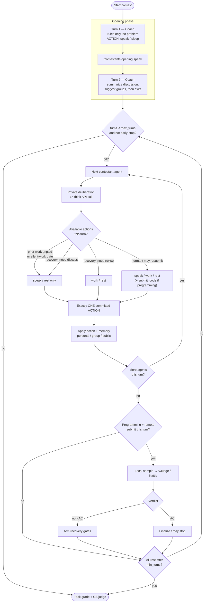
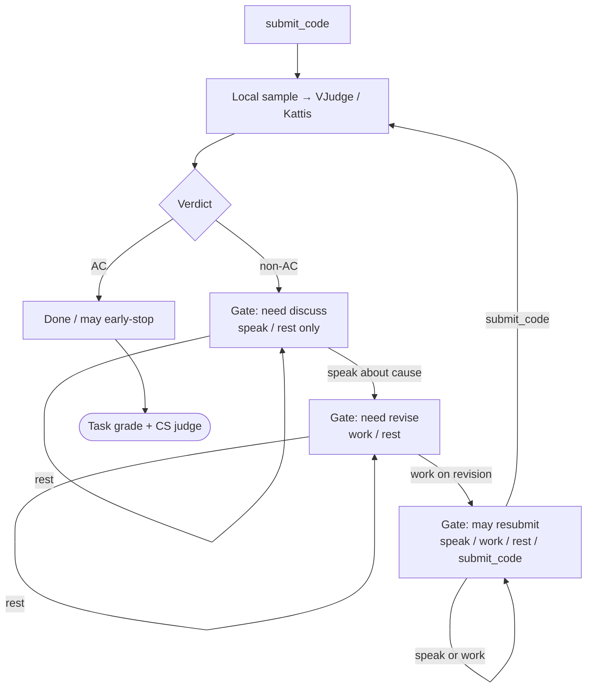
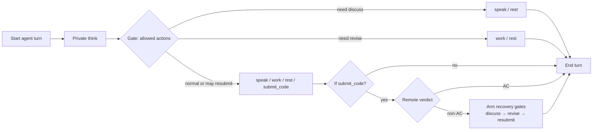

# Weekly Work Summary (2026-08-26 to 2026-09-01)
## 1. Overview

This week moved the project from “multi-agent teams can run competitions” toward “their collaboration can be constrained, observed, remotely judged, and evaluated rigorously.”

The main accomplishments were:

1. Redesigned `open_table_coach` with private reasoning, group communication, and public communication.
2. Introduced a private-deliberation-then-single-action turn protocol, tolerant parsing, discussion gates, and dynamic early stopping.
3. Researched VJudge (no public write API), built a localhost gateway + web adapter, mapped CF/Kattis problems, and made remote verdicts authoritative when configured.
4. Ran 10 ICPC problems with remote Kattis judging and reran three failed problems under a mandatory recovery protocol.
5. Reviewed multi-agent benchmark papers, redesigned the evaluation framework, and applied the calculable metrics to existing runs.

---

## 2. Open Table Coach Collaboration Protocol

### 2.0 Runtime flowchart

End-to-end run under `schema=open_table_coach`, `rules_mode=enforced`:



Non-AC recovery is a wired multi-turn loop (not one free turn):



Turn-level protocol (one contestant):


---

### 2.1 Three-layer memory

Each agent now receives three distinct context layers:

- `personal_memory`: private thoughts visible only to that agent.
- `group_memory`: messages and work visible only to selected agents or a temporary group.
- `public_memory`: discussion and work visible to the whole team.

This lets agents reason privately and publish only useful conclusions, instead of repeatedly placing complete reasoning traces into the shared context.

### 2.2 Private deliberation followed by one committed action

Each contestant turn now follows this sequence:

1. Make one private deliberation API call.
2. Choose one committed action.
3. Finish the turn after that action.

Committed actions include:

- `speak`: discuss, report a conclusion, raise a challenge, or request verification.
- `work`: record durable solution work or a code revision.
- `submit_code`: submit a programming solution.
- `rest`: remain inactive for this turn while retaining the ability to act later.

`speak` and `work` support a `TARGET`, allowing public, one-to-one, or group-scoped communication.

### 2.3 Coach lifecycle

The Coach remains limited to the opening phase:

- Turn 1: reads the rules but not the problem, then provides pre-contest advice.
- Turn 2: summarizes the contestants’ opening discussion, risks, and temporary groups.
- After Turn 2: exits and no longer intervenes.

The Coach may recommend a division of labor, but contestants remain free to change assignments and groups.

### 2.4 Discussion cadence

Discussion gates were added to prevent agents from producing similar `work` actions for many consecutive turns:

- After an agent performs `work`, its next action must be `speak` or `rest`.
- If the entire team only performs `work` during a turn, `work` is temporarily disallowed on the following turn.
- When conflicts appear, agents are prompted to use targeted `speak` messages to resolve them.

Typical limited-mode communication budgets were increased to 60 team messages and 10 messages per agent.

### 2.5 Turn limits and stopping

- The standard `max_turns` was set to 30 across competitions.
- `min_turns` was set to 10 to preserve enough room for collaboration.
- After the minimum, the run can stop early when all contestants choose `rest`; teams no longer need to consume all 30 turns.

### 2.6 Parsing and observability

The scoped-action parser now tolerates:

- Markdown code fences.
- JSON action objects.
- Multiline `TARGET` and `PAYLOAD` fields.
- `ACTION: rest` without a payload.
- Short explanatory text before the action block.

Protocol errors and raw response previews are retained, making it possible to separate task failures, formatting failures, and infrastructure failures.

A new `export_think_action_trace.py` utility exports a readable “private think → committed action” trace. Normal batch runs do not export private thoughts by default.

### 2.7 Non-AC recovery protocol (programming)

After any non-AC remote submission, the required sequence is a gated loop (not a single free turn):

```text
non-AC verdict
  → gate: speak / rest only   (discuss likely cause)
  → gate: work / rest         (concrete revision)
  → gate: allow submit_code   (resubmit to VJudge / Kattis)
  → if still non-AC, repeat
```

The system blocks `work` / `submit_code` until the discuss step is done, and blocks `submit_code` until the revise step is done. See the recovery flowchart in §2.0.

---

## 3. Open Table Coach Experiments

All structured-gold runs below use `schema=open_table_coach`, `rules_mode=enforced`, task judge on, and collaboration judge on (MultiAgentBench CS, 0–5).

### 3.1 Model comparison

| Model | Provider | Status | Tasks | Macro | Score | Mean CS | Artifact |
| --- | --- | --- | ---: | ---: | ---: | ---: | --- |
| `openai/gpt-5.4-mini` | Perplexity | done | 32/32 | 35.55% | 491.33 / 1196 | 3.531 | `results/task_based_structured_gold_perplexity_20260829/` |
| `Qwen/Qwen3.5-35B-A3B-Base` | Tinker | running | 10/32 | 68.83%* | 318.33 / 460* | 2.55* | `results/task_based_structured_gold_tinker_qwen35_35b_base_20260831/` |

\*Partial through `arml_national_team_2012` (resume currently on `arml_national_team_2013`). Numbers will change until 32/32.

### 3.2 GPT-5.4-mini structured-gold batch (complete)

32 tasks: ARML Local 6, ARML National Team 11, Purple Comet 14, HMMT Guts 1.

| Metric | Result |
| --- | ---: |
| Completed and graded | 32/32 |
| Total score | 491.33 / 1196 |
| Macro Task Utility | 35.55% |
| Full-credit tasks | 1/32 (`arml_national_team_2009`) |
| Mean Communication / Planning / CS | 3.688 / 3.375 / 3.531 |
| API calls | 7,834 |
| Tokens | 782,021 |
| Wall time | 18,149.6 seconds |

#### Per-competition totals

| Competition | Tasks | Score | Macro | Mean CS | API | Tokens | Wall (s) |
| --- | ---: | ---: | ---: | ---: | ---: | ---: | ---: |
| `arml_local` | 6 | 167.22 / 260 | 62.73% | 3.833 | 1,050 | 115,245 | 2,476.8 |
| `arml_national_team` | 11 | 271.11 / 550 | 49.29% | 3.591 | 3,543 | 334,018 | 7,963.4 |
| `purple_comet` | 14 | 51.00 / 350 | 15.24% | 3.357 | 3,078 | 320,174 | 7,366.8 |
| `hmmt_guts` | 1 | 2.00 / 36 | 5.56% | 3.500 | 163 | 12,584 | 342.6 |

ARML Local and National Team performed better than Purple Comet and HMMT Guts. The same collaboration protocol does not remove limits from task difficulty, missing diagrams, or incomplete source material.

#### Per-task ledger (full)

Source: `results/task_based_structured_gold_perplexity_20260829/competition_batch.json`.  
`accuracy = score / max_score`. `sec` is wall-clock seconds, rounded.

| competition | problem_id | score | max_score | accuracy | Communication | Planning | CS | turns | api_calls | tokens | sec |
| --- | --- | ---: | ---: | ---: | ---: | ---: | ---: | ---: | ---: | ---: | ---: |
| arml_local | arml_local_2009 | 22.22 | 40 | 55.56% | 4 | 4 | 4.0 | 16 | 183 | 19098 | 395 |
| arml_local | arml_local_2010 | 26.67 | 40 | 66.67% | 4 | 3 | 3.5 | 22 | 255 | 28231 | 581 |
| arml_local | arml_local_2011 | 35.00 | 40 | 87.50% | 4 | 4 | 4.0 | 10 | 111 | 9158 | 239 |
| arml_local | arml_local_2012 | 26.67 | 40 | 66.67% | 4 | 4 | 4.0 | 11 | 123 | 13348 | 304 |
| arml_local | arml_local_2013 | 6.67 | 40 | 16.67% | 4 | 3 | 3.5 | 16 | 183 | 21902 | 473 |
| arml_local | arml_local_2014 | 50.00 | 60 | 83.33% | 4 | 4 | 4.0 | 17 | 195 | 23508 | 485 |
| arml_national_team | arml_national_team_2009 | 50.00 | 50 | 100.00% | 5 | 4 | 4.5 | 11 | 303 | 28722 | 678 |
| arml_national_team | arml_national_team_2010 | 10.00 | 50 | 20.00% | 4 | 3 | 3.5 | 11 | 303 | 27582 | 641 |
| arml_national_team | arml_national_team_2011 | 35.00 | 50 | 70.00% | 4 | 3 | 3.5 | 11 | 303 | 31086 | 671 |
| arml_national_team | arml_national_team_2012 | 40.00 | 50 | 80.00% | 4 | 4 | 4.0 | 10 | 273 | 24230 | 615 |
| arml_national_team | arml_national_team_2013 | 35.00 | 50 | 70.00% | 3 | 3 | 3.0 | 10 | 273 | 30361 | 701 |
| arml_national_team | arml_national_team_2014 | 30.00 | 50 | 60.00% | 4 | 4 | 4.0 | 10 | 273 | 26160 | 631 |
| arml_national_team | arml_national_team_2016 | 0.00 | 50 | 0.00% | 2 | 3 | 2.5 | 10 | 273 | 31537 | 663 |
| arml_national_team | arml_national_team_2017 | 10.00 | 50 | 20.00% | 4 | 3 | 3.5 | 10 | 273 | 29340 | 672 |
| arml_national_team | arml_national_team_2018 | 11.11 | 50 | 22.22% | 4 | 4 | 4.0 | 11 | 303 | 32486 | 727 |
| arml_national_team | arml_national_team_2019 | 5.00 | 50 | 10.00% | 3 | 4 | 3.5 | 11 | 303 | 34470 | 732 |
| arml_national_team | arml_national_team_2023 | 45.00 | 50 | 90.00% | 4 | 3 | 3.5 | 23 | 663 | 38044 | 1232 |
| hmmt_guts | hmmt_guts_2024 | 2.00 | 36 | 5.56% | 4 | 3 | 3.5 | 11 | 163 | 12584 | 343 |
| purple_comet | purple_comet_hs_2018 | 4.00 | 30 | 13.33% | 4 | 3 | 3.5 | 20 | 231 | 25383 | 580 |
| purple_comet | purple_comet_ms_2018 | 1.00 | 20 | 5.00% | 4 | 3 | 3.5 | 19 | 219 | 24868 | 561 |
| purple_comet | purple_comet_hs_2019 | 3.00 | 30 | 10.00% | 3 | 4 | 3.5 | 18 | 207 | 21742 | 490 |
| purple_comet | purple_comet_ms_2019 | 3.00 | 20 | 15.00% | 3 | 2 | 2.5 | 21 | 243 | 25743 | 597 |
| purple_comet | purple_comet_hs_2020 | 5.00 | 30 | 16.67% | 4 | 4 | 4.0 | 19 | 219 | 23036 | 518 |
| purple_comet | purple_comet_ms_2020 | 4.00 | 20 | 20.00% | 3 | 3 | 3.0 | 15 | 171 | 17055 | 394 |
| purple_comet | purple_comet_hs_2021 | 4.00 | 30 | 13.33% | 3 | 3 | 3.0 | 20 | 231 | 22683 | 551 |
| purple_comet | purple_comet_ms_2021 | 5.00 | 20 | 25.00% | 3 | 3 | 3.0 | 24 | 279 | 29740 | 682 |
| purple_comet | purple_comet_hs_2022 | 3.00 | 30 | 10.00% | 3 | 3 | 3.0 | 18 | 207 | 19416 | 454 |
| purple_comet | purple_comet_ms_2022 | 5.00 | 20 | 25.00% | 4 | 3 | 3.5 | 16 | 183 | 16673 | 403 |
| purple_comet | purple_comet_hs_2023 | 2.00 | 30 | 6.67% | 4 | 3 | 3.5 | 20 | 231 | 23706 | 539 |
| purple_comet | purple_comet_ms_2023 | 3.00 | 20 | 15.00% | 4 | 4 | 4.0 | 17 | 195 | 22480 | 483 |
| purple_comet | purple_comet_hs_2024 | 4.00 | 30 | 13.33% | 4 | 4 | 4.0 | 19 | 219 | 21866 | 514 |
| purple_comet | purple_comet_ms_2024 | 5.00 | 20 | 25.00% | 3 | 3 | 3.0 | 21 | 243 | 25783 | 601 |
| **TOTAL** | **32 tasks** | **491.33** | **1196** | **macro 35.55%** | **mean 3.69** | **mean 3.38** | **mean 3.53** | **498** | **7834** | **782021** | **18150** |

### 3.3 Tinker Qwen3.5-35B-A3B-Base (partial, 10/32)

| Metric | Result |
| --- | ---: |
| Completed and graded | 10 |
| Total score | 318.33 / 460 |
| Macro Task Utility | 68.83% |
| Full-credit tasks | 1/10 (`arml_national_team_2009`) |
| Mean Communication / Planning / CS | 3.30 / 1.80 / 2.55 |
| API calls | 2,820 |
| Tokens | 5,365,115 |
| Wall time | 77,111.2 seconds |

#### Per-competition totals (completed so far)

| Competition | Tasks done | Score | Macro | Mean CS | API | Tokens | Wall (s) |
| --- | ---: | ---: | ---: | ---: | ---: | ---: | ---: |
| `arml_local` | 6/6 | 153.33 / 260 | 59.72% | 2.50 | 1,278 | 1,683,829 | 26,904.5 |
| `arml_national_team` | 4/11 | 165.00 / 200 | 82.50% | 2.625 | 1,542 | 3,681,286 | 50,206.7 |
| `purple_comet` | 0/14 | — | — | — | — | — | — |
| `hmmt_guts` | 0/1 | — | — | — | — | — | — |

#### Per-task ledger (completed)

Source: `results/task_based_structured_gold_tinker_qwen35_35b_base_20260831/competition_batch.json`.

| competition | problem_id | score | max_score | accuracy | Communication | Planning | CS | turns | api_calls | tokens | sec |
| --- | --- | ---: | ---: | ---: | ---: | ---: | ---: | ---: | ---: | ---: | ---: |
| arml_local | arml_local_2009 | 22.22 | 40 | 55.56% | 3 | 2 | 2.5 | 27 | 315 | 208911 | 3128 |
| arml_local | arml_local_2010 | 20.00 | 40 | 50.00% | 2 | 2 | 2.0 | 14 | 159 | 472768 | 5788 |
| arml_local | arml_local_2011 | 30.00 | 40 | 75.00% | 2 | 2 | 2.0 | 13 | 147 | 262180 | 3621 |
| arml_local | arml_local_2012 | 31.11 | 40 | 77.78% | 4 | 2 | 3.0 | 30 | 351 | 307093 | 5592 |
| arml_local | arml_local_2013 | 20.00 | 40 | 50.00% | 4 | 2 | 3.0 | 16 | 183 | 128370 | 2335 |
| arml_local | arml_local_2014 | 30.00 | 60 | 50.00% | 3 | 2 | 2.5 | 11 | 123 | 304507 | 6440 |
| arml_national_team | arml_national_team_2009 | 50.00 | 50 | 100.00% | 5 | 2 | 3.5 | 11 | 303 | 731615 | 10304 |
| arml_national_team | arml_national_team_2010 | 35.00 | 50 | 70.00% | 3 | 1 | 2.0 | 12 | 333 | 914173 | 11250 |
| arml_national_team | arml_national_team_2011 | 45.00 | 50 | 90.00% | 4 | 2 | 3.0 | 22 | 633 | 1120623 | 17151 |
| arml_national_team | arml_national_team_2012 | 35.00 | 50 | 70.00% | 3 | 1 | 2.0 | 10 | 273 | 914875 | 11503 |
| **TOTAL** | **10 tasks** | **318.33** | **460** | **macro 68.83%** | **mean 3.30** | **mean 1.80** | **mean 2.55** | **166** | **2820** | **5365115** | **77111** |

#### Paired overlap with GPT-5.4-mini (same 10 tasks)

| Problem | GPT Acc | Tinker Acc | Δ (pp) |
| --- | ---: | ---: | ---: |
| arml_local_2009 | 55.6% | 55.6% | 0.0 |
| arml_local_2010 | 66.7% | 50.0% | −16.7 |
| arml_local_2011 | 87.5% | 75.0% | −12.5 |
| arml_local_2012 | 66.7% | 77.8% | +11.1 |
| arml_local_2013 | 16.7% | 50.0% | +33.3 |
| arml_local_2014 | 83.3% | 50.0% | −33.3 |
| arml_national_team_2009 | 100% | 100% | 0.0 |
| arml_national_team_2010 | 20.0% | 70.0% | +50.0 |
| arml_national_team_2011 | 70.0% | 90.0% | +20.0 |
| arml_national_team_2012 | 80.0% | 70.0% | −10.0 |
| **Macro mean** | **64.64%** | **68.83%** | **+4.19** |

Paired bootstrap 95% CI for the macro difference: `[-9.89, +19.11]` percentage points. Model and provider both changed, and the interval crosses zero, so this is not evidence of a significant improvement.

Tinker used far more provider-recorded tokens and scored lower on CS (especially Planning). Token accounting may differ across providers, so accuracy must be reported with calls, tokens, and wall time.

### 3.4 Three-memory pilot

ARML Local 2009 early three-memory run (`results/arml_local_three_memory_gpt54mini_20260828/`):

| Metric | Result |
| --- | ---: |
| Task Utility | 22.22 / 40 = 55.56% |
| Turns | 12/16 |
| API calls | 135 |
| Tokens | 19,231 |
| Communication / Planning / CS | 4.0 / 3.0 / 3.5 |
| Protocol errors | 6 |
| Wall time | 461.6 seconds |

A later tolerant-parser run on the same task also scored `22.22/40`, while using 21/30 turns, 243 calls, and 32,361 tokens. These runs do not share the same seed or budget, so they are descriptive comparisons rather than a valid memory ablation.

More compact tables also live in [open-table-coach-batch-results.md](open-table-coach-batch-results.md).

---

## 4. Remote Programming Judges

This section covers how VJudge / remote OJ judging was researched, built, and operated—not only the final scores.

### 4.1 Feasibility study (2026-08-26)

Before writing a submit client, I did a read-only feasibility pass documented in [`docs/VJUDGE_INTEGRATION_FEASIBILITY.md`](../VJUDGE_INTEGRATION_FEASIBILITY.md):

1. Confirmed VJudge can host Codeforces problems (`CodeForces-4A`) and ICPC-style contests.
2. Confirmed there is **no official public VJudge write API**; create/submit/poll endpoints live in the web frontend bundles and depend on a logged-in session.
3. Confirmed Cloudflare Turnstile can appear on submit (`challenge` → `needs_human`); captchas are never auto-solved.
4. Confirmed VJudge is a **remote proxy**: it forwards code to Codeforces/Kattis and polls the remote OJ, rather than re-running CF/Kattis tests locally.
5. Chose a semi-automatic architecture: keep local sample judging as a fallback, put cookies only in a localhost gateway, and treat remote verdicts as optional external evidence until the gateway is configured.

Design rules that followed from that study:

- Agents never see `VJUDGE_COOKIE`, Turnstile tokens, or OJ passwords.
- Challenge / login failures stop in `needs_human` instead of retrying forever.
- `Submit Failed` / transport errors are not counted as WA.
- Bundle hashes and form fields can change; the adapter must fail closed when parsing breaks.

### 4.2 Local gateway and VJudge adapter

Implementation is split so the agent environment only talks to localhost:

| Component | Path | Role |
| --- | --- | --- |
| Local gateway | `src/vjudge_gateway.py` | Holds the browser cookie in-process; exposes `/v1/health`, `/v1/submit`, `/v1/runs/{id}` |
| Env client | `src/judge/vjudge_gateway_client.py` | Called by `OlympiadEnvironment` when `VJUDGE_GATEWAY_URL` is set |
| VJudge web adapter | `src/judge/vjudge.py` | Replays observed problem/contest submit endpoints; polls run status |
| Direct Kattis client | `src/judge/kattis.py` | Preferred path for Kattis when `.kattisrc` is available |
| Mapping sync | `collectors/sync_local_vjudge_mappings.py` | Writes `vjudge_oj` / `vjudge_prob_num` into benchmarks |

Working submit flows observed on 2026-08-27 / 2026-08-28:

**Problem mode (default, no private contest):**

```text
POST /problem/submit/{OJ}-{probNum}
  → poll /solution/data/{runId} or status endpoints
  → normalize to AC / WA / TLE / CE / SUBMIT_FAILED / needs_human
```

**Contest mode (optional):**

```text
POST /contest/login/{id}
  → read contest HTML for problem nums + version
  → GET /contest/{id}/submitMethods  (own-account bindingId when method=1)
  → POST /contest/submit/{id}/{num}
  → poll until final / needs_human
```

Per-OJ overrides were added so one gateway can serve both Codeforces and Kattis without sharing the wrong account:

- `VJUDGE_SUBMIT_METHOD_CODEFORCES` / `VJUDGE_BINDING_ID_CODEFORCES`
- `VJUDGE_SUBMIT_METHOD_KATTIS` / `VJUDGE_BINDING_ID_KATTIS`

`method=0` uses VJudge’s default remote account pool; `method=1` uses a bound personal OJ account. For the CF pilots here, own-account binding (`method=1`) was required.

### 4.3 Benchmark mapping

I did not scrape VJudge for every problem. Local packages / known Kattis IDs were synced into benchmark `evaluation` fields:

```text
Codeforces packages 4A, 231A
  → vjudge_oj=CodeForces, vjudge_prob_num=4A|231A, submit_mode=problem

ICPC rows with kattis_id
  → vjudge_oj=Kattis, vjudge_prob_num={kattis_id}, status=remote_judge_ready
```

Command used:

```powershell
e:\agent_olympiad\.venv\Scripts\python.exe collectors\sync_local_vjudge_mappings.py
```

That made `submit_code` able to choose `CodeForces-4A` / `Kattis-bottles` style problem IDs without hard-coding them in the collaboration loop.

### 4.4 Automatic routing and remote authority

Programming submissions now select a backend based on the remote OJ and configuration:

- Codeforces → VJudge client through the local gateway.
- Kattis → gateway routes to the direct Kattis client when `.kattisrc` is present; otherwise VJudge problem mode remains available.
- When remote judging is not configured → local sample judge only (non-final fallback).

Early runs required local sample AC before remote upload. That blocked deferred ICPC tasks that only had remote mappings. The policy was then changed:

> When the gateway is configured, the **remote verdict is authoritative**. Local sample AC is no longer treated as final AC, and remote-ready problems can submit without a local secret package.

The evaluator registry note was updated to `remote_oj_via_vjudge_with_local_sample_fallback`.

### 4.5 Direct Kattis client

Because ICPC WF 2012 maps cleanly to open.kattis.com, Kattis was given a first-class client rather than forcing every ICPC submit through VJudge:

- Authenticates with the home-directory `.kattisrc` API token.
- Maps Python 3 and C++ to the expected Kattis language and filename.
- Extracts the submission ID from the response.
- Polls Kattis JSON status.
- Normalizes remote results into AC, WA, TLE, CE, and other verdicts.
- Uses `main.py` as the Python entry point, fixing the earlier filename mismatch that caused remote reject / CE-like failures.

This is why the 10-problem ICPC batch could report official remote AC for `bottles` and `fibonacci`.

### 4.6 Day-to-day remote-judge workflow

Typical operator steps used this week:

1. Log into [vjudge.net](https://vjudge.net) in a browser; DevTools → Network → copy the `Cookie` header into `.env` as `VJUDGE_COOKIE`.
2. For Codeforces own-account submits, bind the CF account in VJudge and set `VJUDGE_SUBMIT_METHOD=1` plus the matching `VJUDGE_BINDING_ID_*`.
3. For Kattis, place a valid `.kattisrc` in the home directory.
4. Start the gateway:

```powershell
e:\agent_olympiad\.venv\Scripts\python.exe src\vjudge_gateway.py serve --port 8787
```

5. Point the agent batch at the gateway:

```text
VJUDGE_GATEWAY_URL=http://127.0.0.1:8787
VJUDGE_SUBMIT_MODE=problem
```

6. Run a programming competition batch; inspect `code_submissions` in the transcript for remote verdicts, `run_id`, and `needs_human` stops.
7. Refresh the cookie when the session expires; stop and intervene manually on Turnstile / Challenge.

Focused tests covering this path: `tests/test_vjudge_client.py`, `tests/test_vjudge_turn_loop.py`, `tests/test_vjudge_schema_adapters.py`.

### 4.7 Ten-problem ICPC Kattis experiment

Ten mapped ICPC World Finals 2012 problems were run with GPT-5.4-mini, `open_table_coach`, and a 30-turn limit (`results/icpc_kattis_10_perplexity_20260831/`).

| Metric | Result |
| --- | ---: |
| Official AC | 2/10 = 20% |
| AC problems | `bottles`, `fibonacci` |
| API calls | 916 |
| Turns | 250 |
| Tokens | 209,770 |
| Mean CS | 3.25 |
| Submission attempts | 49 |
| Verdicts | 2 AC, 27 WA, 11 TLE, 1 CE, 8 SUBMIT_FAILED |

#### Per-problem ledger

`score/max_score` use official remote AC as `1/1` or `0/1` over all 10 tasks (not the graded-only denominator).

| competition | problem_id | score | max_score | accuracy | Communication | Planning | CS | turns | api_calls | tokens | sec | wrong_subs |
| --- | --- | ---: | ---: | ---: | ---: | ---: | ---: | ---: | ---: | ---: | ---: | ---: |
| icpc | icpc_wf_2012_bottles | 1 | 1 | 100.00% | 5 | 4 | 4.5 | 4 | 16 | 4026 | 84 | 0 |
| icpc | icpc_wf_2012_bustour | 0 | 1 | 0.00% | 2 | 3 | 2.5 | 30 | 64 | 23449 | 399 | 7 |
| icpc | icpc_wf_2012_fibonacci | 1 | 1 | 100.00% | 4 | 4 | 4.0 | 6 | 28 | 5743 | 125 | 0 |
| icpc | icpc_wf_2012_flightpath | 0 | 1 | 0.00% | 2 | 4 | 3.0 | 30 | 118 | 29155 | 497 | 5 |
| icpc | icpc_wf_2012_infiltration2 | 0 | 1 | 0.00% | 3 | 4 | 3.5 | 30 | 40 | 11412 | 220 | 6 |
| icpc | icpc_wf_2012_keys | 0 | 1 | 0.00% | 3 | 2 | 2.5 | 30 | 178 | 28410 | 585 | 2 |
| icpc | icpc_wf_2012_minflow | 0 | 1 | 0.00% | 2 | 3 | 2.5 | 30 | 178 | 31435 | 637 | 2 |
| icpc | icpc_wf_2012_rangers | 0 | 1 | 0.00% | 3 | 3 | 3.0 | 30 | 88 | 21897 | 428 | 6 |
| icpc | icpc_wf_2012_roomservice | 0 | 1 | 0.00% | 3 | 4 | 3.5 | 30 | 130 | 25554 | 526 | 4 |
| icpc | icpc_wf_2012_safebet | 0 | 1 | 0.00% | 3 | 4 | 3.5 | 30 | 76 | 28689 | 413 | 7 |
| **TOTAL** | **10 tasks** | **2** | **10** | **20.00% AC** | **mean 3.00** | **mean 3.50** | **mean 3.25** | **250** | **916** | **209770** | **3914** | **39** |

The artifact’s graded-only ratio of `2/2 = 100%` is misleading because only AC tasks entered that denominator. The defensible task-level result is `2/10 = 20%`.

### 4.8 Five-problem ICPC recovery-gate rerun (`max_turns=30`)

Same GPT-5.4-mini + `open_table_coach` + remote Kattis setup, with the non-AC recovery gate enabled (`results/icpc_kattis_5_recovery_gate_30turn_20260902/`). Problems: `bottles`, `bustour`, `fibonacci`, `flightpath`, `infiltration2`.

| Metric | Result |
| --- | ---: |
| Official AC | 2/5 = 40% |
| AC problems | `bottles`, `fibonacci` |
| Score | 2 / 5 |
| Macro Task Utility | 40.00% |
| Mean CS | 3.30 |
| API calls | 316 |
| Tokens | 72,280 |
| Turns | 104 |
| Wall (s) | 1,264.1 |

#### Per-problem ledger

| competition | problem_id | score | max_score | accuracy | CS | turns | api_calls | tokens | sec | wrong_subs |
| --- | --- | ---: | ---: | ---: | ---: | ---: | ---: | ---: | ---: | ---: |
| icpc | icpc_wf_2012_bottles | 1 | 1 | 100% | 4.5 | 4 | 16 | 3614 | 71.2 | 0 |
| icpc | icpc_wf_2012_bustour | 0 | 1 | 0% | 2.5 | 30 | 106 | 23637 | 415.4 | 5 |
| icpc | icpc_wf_2012_fibonacci | 1 | 1 | 100% | 4.0 | 10 | 30 | 6704 | 139.1 | 1 |
| icpc | icpc_wf_2012_flightpath | 0 | 1 | 0% | 3.0 | 30 | 82 | 21439 | 342.5 | 6 |
| icpc | icpc_wf_2012_infiltration2 | 0 | 1 | 0% | 2.5 | 30 | 82 | 16886 | 296.0 | 5 |
| **TOTAL** | **5 tasks** | **2** | **5** | **40% AC** | **mean 3.30** | **104** | **316** | **72280** | **1264.1** | **17** |

Sheet export: `results/_sheets_exports/04_icpc_kattis_5_recovery_30turn.tsv`.

---

## 5. Multi-Agent Evaluation Research

This week’s benchmark review covered MultiAgentBench, AgentBench, LLM-Coordination, SOTOPIA, ReConcile, and Scaling Multi-Agent Collaboration.

The main conclusions were:

1. MultiAgentBench Communication, Planning, and CS remain useful diagnostic measures but should not determine the primary ranking.
2. Clear-looking communication does not imply a correct result; CS must remain separate from verifiable Task Utility.
3. Multi-agent systems must be compared with compute-matched single agents, independent ensembles, and isolated subagents.
4. An improvement can only be attributed to interaction if the interactive team outperforms every matched control.

### 5.0 Unified final metrics for every competition

Mathematics, programming, and other objectively graded competitions use the same four final metrics. They are reported separately and are never averaged into a composite score:

| Metric | Universal definition | What it measures |
| --- | --- | --- |
| `TaskUtility` | \(U(X)=\operatorname{mean}_{i,s}(\text{official score}_{i,s}/\text{maximum score}_{i,s})\) | Final task quality |
| `CausalCollaborationEffectiveness` (`CCE`) | For a fully successful task, \(\operatorname{card}(C_i)/\operatorname{card}(T_i)\), where \(C_i\) is the set of actions on a causal path to success and \(T_i\) is every observable contestant action; otherwise `0`; macro-averaged across tasks | Fraction of team actions that causally contributed to successful completion |
| `ActiveAgentRate` (`AAR`) | Per-task fraction of contestants making at least one substantive action, macro-averaged across tasks | Whether the nominal team was actually used |
| `ActionBalance` (`AB`) | \(1-G_i/(1-1/N_i)\), macro-averaged across tasks, where \(G_i\) is the Gini coefficient of contestants' substantive-action counts | Whether contribution opportunities were concentrated in one agent |

A substantive action for AAR/AB is a contestant `speak`, `work`, `submit_final`, or `submit_code`. Coach and contest-control actions, private `think`, and `rest` are excluded. AAR and AB are deterministic from the existing action log, lie in `[0,1]`, and give every task equal weight. `AAR=1` means every contestant contributed at least once; `AB=1` means substantive action counts were equal.

CCE follows [AgentWorld §3.5 and Appendix F](https://ryanzhumich.github.io/files/AgentWorld.pdf). It treats every observable contestant action—including `rest`—as one graph node, seeds the graph with the terminal successful submission, and uses backward, per-turn binary LLM judgments to add causal predecessors. The report includes both strict CCE over all attempted tasks and `CCE|success` over full-success tasks only. The first is the official AgentWorld-style metric; the second separates collaboration efficiency on successes from the system's success rate. AgentWorld used GPT-4.1 at temperature 0; this initial post-hoc application uses `openai/gpt-5.4-mini` through Perplexity at temperature 0 and records the judge identity with every output.

Domain mapping is deliberately small:

- Mathematics: task utility is partial-credit score divided by task maximum.
- Programming: task utility is `1` for AC and `0` otherwise.
- Any other competition: use its official normalized task score in `[0,1]`.

The final result table for every run therefore has this fixed shape:

```text
Run | Tasks | TaskUtility | CCE | CCE|success | ActiveAgentRate | ActionBalance | API | Tokens | Wall (s)
```

API calls, tokens, cost, and wall time remain efficiency columns. Communication, Planning, and CS remain optional diagnostics and do not enter the main ranking. Programming-only recovery metrics remain a domain appendix. `AAR` and `AB` measure observable participation, not causal benefit or semantic correctness; causal metrics such as `Δcomm` stay in the future-research framework until matched controls exist.

### 5.1 Complete metric framework

The benchmark can additionally report five diagnostic layers. They should not be averaged into one composite score.

#### Layer A: Task outcome and efficiency

| Metric | Definition | Role |
| --- | --- | --- |
| `TaskUtility` | Official score divided by maximum score, in `[0,1]` | Primary outcome |
| `SuccessRate` / `ACRate` | Successful tasks divided by all attempted tasks | Primary outcome |
| `WrongSubmissionRate` | Penalized rejected submissions divided by submissions | Reliability |
| `TimeToSuccess` | Wall time or turns until the first successful result | Speed |
| `UtilityPer1kTokens` | Sum of normalized task utility divided by output tokens, multiplied by 1,000 | Token efficiency |
| `UtilityPerCall` | Sum of normalized task utility divided by API calls | Call efficiency |
| `CostToSuccess` | Total monetary cost divided by successful tasks | Economic efficiency |
| `LatencyToSuccess` | End-to-end latency until a successful final result | Operational efficiency |

Task outcome, cost, and latency must be reported separately. A system should be considered preferable only when it improves utility or lies on the cost/latency Pareto frontier.

#### Layer B: Causal collaboration gain

Every task, model, and seed needs five experimental conditions:

| Symbol | Condition | Description |
| --- | --- | --- |
| `S` | Compute-matched solo | One agent receives the same total inference budget |
| `E` | Independent ensemble | `N` isolated samples, followed by a blind aggregator |
| `D` | Isolated subagents | Agents divide work but cannot exchange intermediate messages |
| `T` | Interactive team | Full multi-agent communication |
| `T−L` | Team ablation | Interactive team with one mechanism or memory layer removed |

The required causal metrics are:

```text
SamplingGain       = U(E) - U(S)
DivisionGain       = U(D) - U(S)
InteractionGain    = U(T) - U(D)
Δcomm              = U(T) - U(E)
CollaborationSynergy
                   = U(T) - max(U(S), U(E), U(D))
MemoryMarginalValue(L)
                   = U(T) - U(T-L)
```

Interpretation:

- `SamplingGain` measures the value of additional independent attempts.
- `DivisionGain` measures the value of decomposing work without communication.
- `InteractionGain` measures the value added by interaction beyond isolated division.
- `Δcomm` compares communication against independent sampling under an equal budget.
- `CollaborationSynergy > 0` means the interactive team beats every matched non-interactive control.
- `MemoryMarginalValue(L)` measures the paired effect of personal, group, or public memory.

These are paired estimands. For task `i` and seed `s`, calculate the within-pair difference first and then aggregate:

```text
Δcomm(i,s) = U(T,i,s) - U(E,i,s)
```

The paper should report the mean paired effect and paired bootstrap 95% confidence interval. A positive sample mean alone is insufficient; the lower confidence bound should exceed zero before claiming a collaboration benefit.

#### Layer C: Process quality and information flow

These metrics explain why a team succeeded or failed:

| Metric | Definition |
| --- | --- |
| `UsefulDiversity` | Number of independently derived, non-equivalent solution methods that were later verified as correct |
| `ValidatedAdoptionRate` | Adopted cross-agent claims that contributed to a correct final outcome divided by all adopted cross-agent claims |
| `ChallengePrecision` | Challenges targeting claims later proven wrong divided by adjudicated challenges |
| `CorrectionYield` | Wrong claims changed to correct after a challenge or verification divided by adjudicated correction opportunities |
| `DuplicateWorkRate` | Work artifacts repeating the same task and method without new evidence divided by all work artifacts |
| `InformationLeakRate` | Unauthorized deliveries or reads of restricted memory divided by restricted-memory delivery/read events |
| `ContributionBalance` | Distribution of verified effective contributions across agents, not distribution of message words |
| `CommunicationEfficiency` | Verified adopted contributions divided by communication tokens, normally per 1,000 tokens |
| `SynthesisFidelity` | Correct verified claims preserved in the final answer divided by correct verified claims available before synthesis |
| `UnresolvedDisagreementRate` | Adjudicated disagreements left unresolved at final submission divided by all adjudicated disagreements |

These require semantic event lineage. Keyword mentions such as “verify” or lexical overlap are not sufficient.

#### Layer D: Feedback, correction, and recovery

For programming tasks, each non-AC submission opens a recovery episode:

```text
RecoveryProtocolRate
  = episodes containing speak → work → resubmit
    / eligible non-AC episodes

ChangedResubmitRate
  = resubmissions with a changed normalized source hash
    / resubmissions

DuplicateResubmitRate
  = unchanged-source resubmissions
    / resubmissions

EffectiveRecoveryRate
  = recovery episodes reaching the failure-specific target
    / eligible objective-verdict episodes

Recovery@k
  = failed first submissions reaching AC within the next k attempts
    / failed first submissions with k-attempt follow-up opportunity

FeedbackToActionLatency
  = turns or wall time from verdict delivery to the first diagnosis,
    revision, and resubmission
```

Failure-specific repair must remain separate:

- `CERepairRate`: CE followed by a successfully compiled submission.
- `TLERepairRate`: TLE followed by a non-TLE submission on the same task.
- `WARepairRate`: WA followed by AC.
- `FailureToACRate`: any objective failure followed by AC.
- `RepairRate`: an incorrect claim or submission becoming correct after discussion.
- `HarmRate`: a correct claim or candidate becoming incorrect after discussion.

CE, TLE, and WA should not be placed on one arbitrary linear severity scale.

#### Layer E: Exploration quality

`EffectiveSampleSize` estimates how many genuinely independent attempts the team produced after accounting for correlated errors. Under an equicorrelation approximation:

```text
EffectiveSampleSize = N / (1 + (N - 1) × ρerror)
```

Here, `N` is the number of agents or samples and `ρerror` is the mean pairwise correlation of their per-task error indicators. This requires each agent to produce an independently scoreable pre-discussion answer across many tasks and seeds.

### 5.2 What was calculated from finished runs

These numbers come from the completed artifacts above. Causal collaboration gains remain unidentified, not zero.

#### Unified final table for completed runs

| Run | Tasks | TaskUtility | CCE | CCE\|success | ActiveAgentRate | ActionBalance | API | Tokens | Wall (s) |
| --- | ---: | ---: | ---: | ---: | ---: | ---: | ---: | ---: | ---: |
| Perplexity GPT-5.4-mini structured gold | 32 | **35.55%** | **1.49%** | **47.68%** (72/151 actions; 1 full-success task) | **99.79%** | **91.05%** | 7,834 | 782,021 | 18,149.6 |
| ICPC Kattis recovery gate, 30 turns | 5 | **40.00%** (2/5 AC) | **34.29%** | **85.71%** (2 AC tasks) | **100.00%** | **94.31%** | 316 | 72,280 | 1,264.1 |

Calculation:

```text
Mathematics TaskUtility = (1/32) × Σ_i(score_i / max_score_i) = 35.55%
ICPC TaskUtility        = (1/5) × Σ_i 1[verdict_i = AC]       = 2/5 = 40.00%
CCE_i                  = |causally contributing actions_i| / |all actions_i|
CCE                    = mean_i(CCE_i), with CCE_i = 0 unless task i fully succeeds
CCE|success            = mean_i(CCE_i | task i fully succeeds)
AAR                     = mean_i(active contestants_i / contestants_i)
AB                      = mean_i[1 - Gini(action counts_i) / (1 - 1/N_i)]
```

The CCE causal graphs and per-agent contribution rates are stored in `results/task_based_structured_gold_perplexity_20260829/cce_results.json` and `results/icpc_kattis_5_recovery_gate_30turn_20260902/cce_results.json`. The very high `AAR` and `AB` values show broad, balanced participation under the enforced round-robin protocol, while CCE shows which of those actions were judged causally useful. None of these observational process metrics proves that collaboration caused a score improvement; that claim still requires matched controls. The 158-problem ICPC batch is still running and is excluded until complete.

| Metric | Status | Computed value from current artifacts |
| --- | --- | --- |
| TaskUtility (Perplexity 32) | Calculated | macro `35.55%` |
| TaskUtility (Tinker 10) | Calculated | macro `68.83%` |
| AC Rate (ICPC 10) | Calculated | `2/10 = 20%` |
| Utility per 1k tokens (Perplexity) | Calculated | `0.455` task-equivalents / 1k tokens |
| Utility per 1k tokens (Tinker) | Calculated | `0.128` task-equivalents / 1k tokens |
| Mean CS (Perplexity / Tinker / ICPC) | Calculated | `3.531` / `2.55` / `3.25` |
| CS ↔ TaskUtility (Perplexity n=32) | Calculated | Pearson `r=0.480`, Spearman `ρ=0.407` |
| RecoveryProtocolRate (ICPC initial → rerun) | Calculated | `7.69% → 75.00%` |
| ChangedResubmitRate | Calculated | `97.44% → 93.75%` |
| EffectiveRecoveryRate | Calculated | `0% → 0%` |
| Recovery@1/@2/@3 | Calculated | `0% / 0% / 0%` |
| GPT team−solo raw deltas (Phase B, ARML 2009) | Descriptive only | centralized `+55.56` pp; round-table `+44.44` pp; decentralized `+33.33` pp |
| Claude team−solo raw deltas | Descriptive only | centralized `−33.33` pp; round-table `0`; decentralized `−22.22` pp |
| Gemini team−solo raw deltas | Descriptive only | centralized `−11.11` pp; round-table `−11.11` pp; decentralized `0` |
| Tinker−Perplexity paired macro Δ (10 tasks) | Descriptive only | `+4.19` pp; 95% CI `[-9.89, +19.11]` |
| SamplingGain | Not identifiable | needs matched independent ensemble |
| DivisionGain | Not identifiable | needs matched isolated subagents |
| InteractionGain | Not identifiable | needs matched isolated subagents |
| Δcomm | Not identifiable | needs matched team vs independent ensemble |
| CollaborationSynergy | Not identifiable | needs `S`, `E`, `D`, and `T` together |
| MemoryMarginalValue | Not identifiable | needs paired memory ablations |
| EffectiveSampleSize | Not identifiable | needs per-agent pre-discussion answers over seeds |

The table you pasted earlier (≈7–15 turns, ≈30–90 API calls) is from an older lower-budget run. The finished `open_table_coach` structured-gold batch above is the current authoritative ledger (`max_turns=30`, private deliberation, discussion gates).

The existing runs support:

- `TaskUtility`, success/AC, and wrong submissions.
- API calls, tokens, wall time, and solved-per-1k-tokens.
- Descriptive correlation between CS and Task Utility.
- `RecoveryProtocolRate`, `ChangedResubmitRate`, and `DuplicateResubmitRate`.
- `EffectiveRecoveryRate`, `Recovery@k`, and `FeedbackToActionLatency`.
- Existing deterministic lexical process proxies.

Across the 32 Perplexity structured-gold tasks:

- CS versus Task Utility: Pearson `r=0.480`.
- CS versus Task Utility: Spearman `ρ=0.407`.
- Verification-mention rate versus utility: `r=-0.185`.
- Duplicated-effort proxy versus utility: `r=+0.320`.

These counterintuitive signs confirm that mentioning “verify” does not prove valid verification and lexical similarity does not prove wasted work. Lexical process metrics should be used to locate transcripts for inspection, not as primary ranking metrics.

### 5.3 Why the causal metrics are currently not identifiable

The following values are not zero; the historical experiment matrix does not contain the necessary matched cells:

| Metric | Missing evidence |
| --- | --- |
| `SamplingGain` | No compute-matched independent ensemble |
| `DivisionGain` | No compute-matched isolated-subagent condition |
| `InteractionGain` | No matched isolated-subagent baseline |
| `Δcomm` | No matched interactive-team versus independent-ensemble pair |
| `CollaborationSynergy` | `S`, `E`, `D`, and `T` are not all present |
| `MemoryMarginalValue` | No paired runs removing one memory layer at a time |
| `EffectiveSampleSize` | No per-agent pre-discussion answer/error matrix over repeated tasks and seeds |
| `UsefulDiversity` | No method identity, independence, or correctness lineage |
| `ValidatedAdoptionRate` | No claim-level adoption and final-outcome links |
| `ChallengePrecision` | Challenges are not linked to adjudicated claims |
| `InformationLeakRate` | Visibility is recorded, but actual context delivery/read events are not audited |
| `CommunicationEfficiency` | Communication tokens are not linked to verified adopted contributions |

The existing Phase B team-minus-solo differences are not substitutes for these metrics because the team conditions use different calls, tokens, turns, and agent counts.

### 5.4 How to make the metrics identifiable

#### Required run matrix

For every selected task, model, and seed, run:

```text
S: compute-matched solo
E: N independent samples + blind aggregator
D: N isolated subagents + aggregator
T: interactive team
T-personal: team without personal memory
T-group: team without group memory
T-public: team without public memory
T-coach: team without Coach
T-gate: team without discussion gate
```

The same row must share:

- `task_id` and exact problem content hash.
- Model and immutable model version.
- Seed, temperature, and decoding parameters.
- Maximum input/output tokens.
- Total API-call and tool-call budget.
- Judge and submission budget.
- Rules and prompt-template hashes.
- Aggregator model and aggregator budget.
- Cost and latency cap.

Agent order and role assignment should be permuted across seeds to prevent one fixed roster position from driving the result.

#### Required event schema

Claims, work artifacts, messages, and submissions need stable IDs:

```json
{
  "event_id": "event-...",
  "claim_id": "claim-...",
  "artifact_id": "artifact-...",
  "submission_id": "submission-...",
  "created_by": "Agent_2",
  "derived_from": ["claim-..."],
  "challenged_by": ["Agent_4"],
  "verified_by": ["Agent_1"],
  "adopted_in": ["submission-..."],
  "method_id": "method-...",
  "visibility": "group",
  "authorized_recipients": ["Agent_1", "Agent_2"],
  "delivered_to": ["Agent_1", "Agent_2"],
  "final_outcome": "correct"
}
```

The system should also log:

- Tokens by agent, action, and visibility.
- Pre-discussion answer and confidence for every agent.
- Verdict-delivery timestamp.
- Normalized source hash for every programming submission.
- Failure diagnosis linked to a specific verdict.
- Aggregator inputs and outputs.
- Prompt, rules, and model version hashes.

#### Analysis procedure

1. Run at least five seeds per cell; use ten seeds for primary claims.
2. Calculate per-task, per-seed paired differences.
3. Report macro Task Utility (mean of per-task accuracies).
4. Compute paired bootstrap 95% confidence intervals.
5. Report effect sizes together with tokens, calls, cost, and latency.
6. Use permutation tests for agent order and role assignment.
7. Validate 10%–20% of process annotations with two human annotators.
8. Blind LLM judges to schema name, system name, and final leaderboard position.
9. Report inter-annotator agreement and judge-versus-human correlation.
10. Keep CS and lexical proxies in diagnostic appendices rather than the primary ranking.

### 5.5 Minimum implementation changes

The smallest implementation plan is:

1. Add `condition`, `seed`, `replicate_id`, `budget_contract`, `model_hash`, `prompt_hash`, and `rules_hash` to every run result.
2. Add runners for `compute_matched_solo`, `independent_ensemble`, and `isolated_subagents`.
3. Add feature flags for personal memory, group memory, public memory, Coach, and the discussion gate.
4. Add claim/artifact/submission lineage events to the transcript.
5. Extend the analyzer to join matched cells and calculate the formulas above.
6. Reject comparisons when budgets or hashes do not match instead of silently reporting a gain.
7. Produce paired bootstrap confidence intervals and cost/latency Pareto summaries.

---

## 6. Stability and Test Fixes

Additional fixes completed this week include:

- Made action parsing tolerant of code fences, JSON, and leading prose.
- Counted format-error `rest` actions correctly during early stopping.
- Added the missing `RuleCardError` import.
- Aligned Codeforces `cf_4A` team size with the rule card.
- Updated the canonical rule-bundle count after adding Codeforces rules.
- Corrected the Tinker environment-variable test scope.
- Isolated programming-judge tests from external `VJUDGE_*` variables.
- Fixed the Kattis Python entry-point filename.

Focused tests now cover:

- Coach lifecycle and permissions.
- Three-memory visibility.
- Private deliberation followed by one committed action.
- Scoped `speak` and `work`.
- Early stopping.
- The non-AC recovery gate.
- Kattis login, submission, and polling.
- Per-OJ VJudge routing and language mapping.
- Think-to-action trace export.

---

## 7. Main Conclusions

This week established that:

- Agents can reason privately and choose public, group, or targeted communication.
- The Coach only handles pre-contest and opening coordination.
- Teams can stop before the turn limit through collective rest.
- Non-AC results trigger an explicit discussion and revision sequence.
- Codeforces and Kattis submissions can select the appropriate remote backend automatically through a cookie-isolated localhost gateway.
- VJudge is treated as an experimental remote proxy with human takeover on Turnstile; local sample AC is never reported as official AC.
- Structured-gold and ICPC experiments now produce reviewable artifacts and remote verdicts.
- The research question has shifted from “do the agents communicate well?” to “does information exchange produce verifiable gains beyond additional sampling and compute?”

The main experimental finding is:

> Enforcing discussion can substantially change collaboration behavior, but discussion alone is insufficient to improve correctness. Matched controls and repeated-seed experiments are needed to distinguish interaction gains from sampling and compute gains.

---

## 8. Next Steps

1. Add compute-matched `solo / independent ensemble / isolated subagent / interactive team` experiments.
2. Run at least five seeds per condition and ten for key claims; report paired bootstrap 95% confidence intervals.
3. Ablate memory, Coach, private chat, group chat, and the discussion gate independently.
4. Add claim and artifact lineage IDs for adoption, challenge, verification, and correction metrics.
5. Separate ICPC recovery logic for CE, WA, and TLE, and require revisions tied to the observed failure class.
6. Complete the remaining Tinker structured-gold tasks before drawing model-level comparisons.

---

## 9. Related Documents and Artifacts

- [Open Table Coach batch results](open-table-coach-batch-results.md)
- [Rule-card injection and Open Table Coach worklog](worklog-8.21.md)
- [ICPC evaluation and leaderboard](icpc-evaluation-and-leaderboard.md)
- [VJudge integration feasibility](../VJUDGE_INTEGRATION_FEASIBILITY.md)
- `results/task_based_structured_gold_perplexity_20260829/`
- `results/task_based_structured_gold_tinker_qwen35_35b_base_20260831/`
- `results/icpc_kattis_10_perplexity_20260831/`
- `results/icpc_kattis_3_recovery_20260831/`
- `results/arml_local_three_memory_gpt54mini_20260828/`
- `results/vjudge_cf_4a_three_schemas/`
- `results/vjudge_cf_231a_open_table_coach/`
